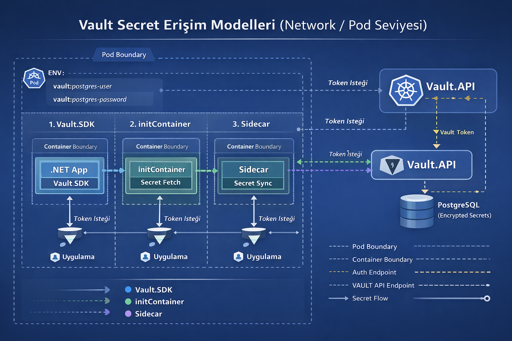
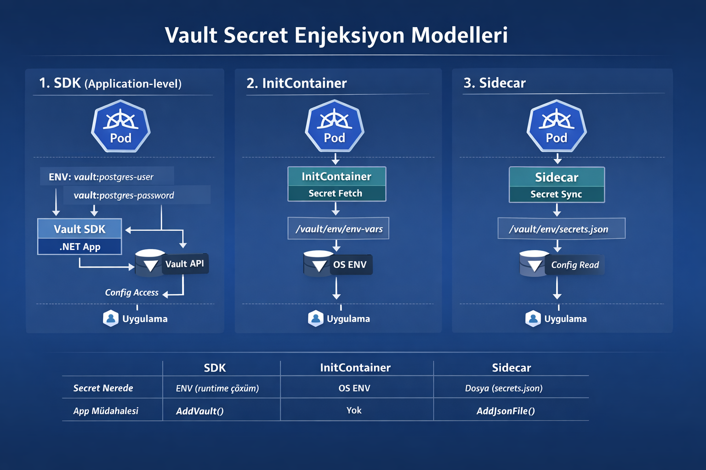

# Vault SDK & Secret Management

Bu proje, Kubernetes ortamında çalışan uygulamaların hassas verilere (secrets) güvenli bir şekilde erişmesini sağlayan
Vault entegrasyon çözümlerini sunar.

> Application-level Secret as a Service

## Kurulum

Projenize uygun SDK sürümünü NuGet üzerinden yükleyebilirsiniz:

* **.NET 10:** `dotnet add package Vault.SDK.Net10 --version 1.0.3`
* **.NET 8:** `dotnet add package Vault.SDK.Net8 --version 1.0.0`

---

## Kimlik Doğrulama Akışı

Sistem, Kubernetes Service Account kimliğini kullanarak Vault üzerinden otomatik token üretimi sağlar:

1. **Pod:** Kubernetes kimlik bilgilerini (JWT) alır ve **Vault.API**'ye iletir.
2. **Vault.API:** Gelen kimliği Kubernetes API üzerinden doğrular.
3. **Doğrulama:** Başarılı doğrulama sonrası bir **Vault Token** üretilir.
4. **Erişim:** Pod, bu token'ı kullanarak yetkili olduğu secret'lara erişir.


---

## Secret Enjeksiyon Modelleri

Uygulamanızın mimarisine göre üç farklı erişim yönteminden birini seçebilirsiniz:

| Özellik             | 1. SDK (Uygulama Seviyesi)         | 2. InitContainer                       | 3. Sidecar                    |
|:--------------------|:-----------------------------------|:---------------------------------------|:------------------------------|
| **Secret Konumu**   | Çalışma zamanı (Runtime) çözümü    | İşletim Sistemi ENV (OS ENV)           | Yerel Dosya (`secrets.json`)  |
| **Uygulama Etkisi** | `AddVault()` metodu eklenir        | Müdahale gerekmez                      | `AddJsonFile()` eklenir       |
| **Yöntem**          | SDK doğrudan Vault API ile konuşur | Başlangıçta secret'ları çeker ve biter | Sürekli senkronizasyon sağlar |

### Uygulama Seviyesi (Secret as a Service) Akışı

```text
ENV (vault:key) -> Vault SDK -> Vault API (HTTPS) -> In-memory ConfigurationProvider -> Uygulama Kullanımı

```



---

## Altyapı Bileşenleri

* **Vault.API:** Kimlik doğrulama ve PostgreSQL üzerindeki şifrelenmiş (encrypted) verilere erişim sağlar.
* **Vault.UI:** Secret verilerinin yönetimi için CRUD paneli sunar.
* **PostgreSQL:** Tüm secret verilerini şifrelenmiş formatta saklar.
